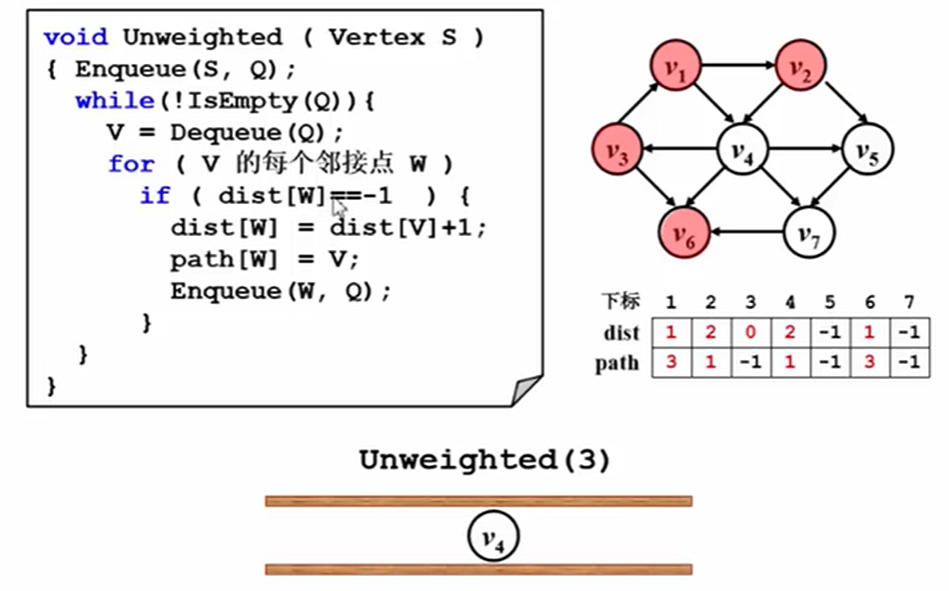
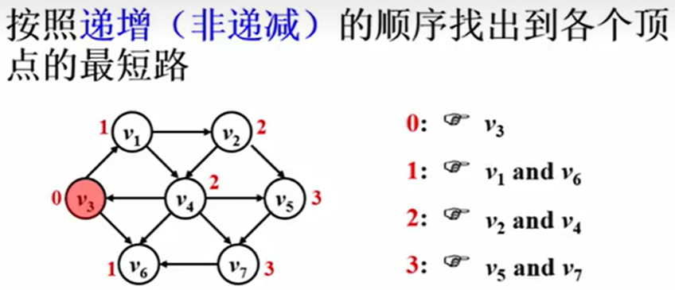
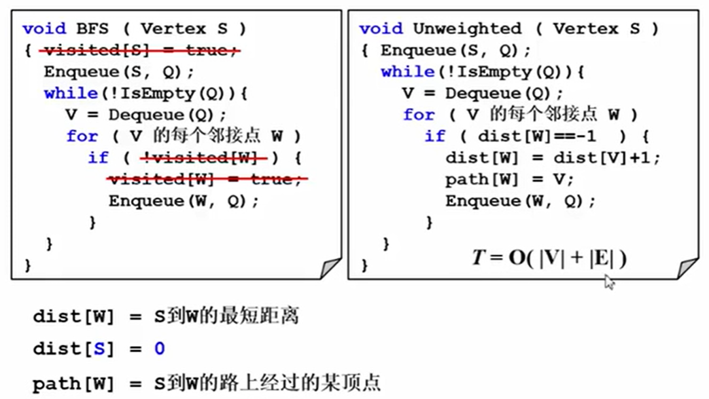
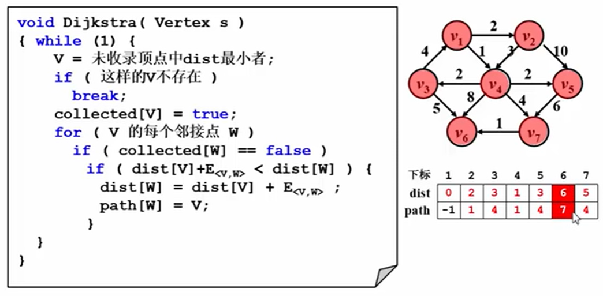
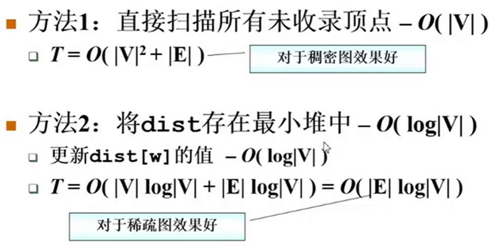
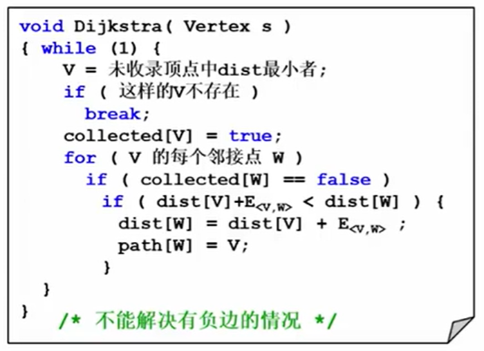
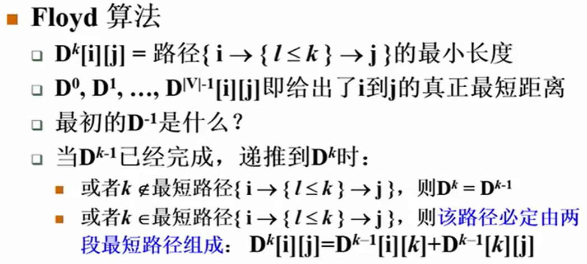
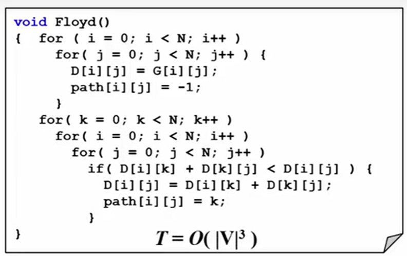

# 图理论
## 建图和图存储
虚拟顶点：密集图，图中边很多，导致建图时间很长，且存储边的容器很大。可以利用虚拟顶点增加顶点个数，大幅减小边的数量  
> 相关题目：leetcode 0127 单词接龙，无向图中 hot, hit, hat, hut, het, 如果两两链接，总共有10\*2条边 都指向h*t，只有5\*2条边，缩小了一半

## 图的遍历
1 访问顶点，将该顶点加入队列，等待处理该顶点的邻接点  
2 从队列首部取出顶点，处理该顶点，即访问该顶点的所有邻接点，并放入队列  
> 例如A-B-C
> 1 队列初始化时放入A，表示A已访问，等待处理A的所有邻接点    
> 2 当从队列中取出A时，就是处理A，即访问的所有邻接点例如B，将B存入队列，即访问过B后等待处理B的所有邻接点

队列意义：存放已访问待处理的顶点  
visited意义：判断将要加入队列的顶点是否已经被处理过，如果被处理过就不再加入队列  
### 图的广度优先遍历

### 图深度优先搜索dfs 
### 带标记dfs
```python
graph ={}
ans= []
visited={}
def dfs(s1, s2, weight):
    # 带返回值，防止错误：s1,s2都在图中，但是不在同一个集合，没有s1到s2的路径，这时需要给结果集中添加-1.0
    if s1 not in graph or s2 not in graph:
        ans.append(-1.0)
        return True
    if s1 == s2:
        ans.append(weight)
        return True
    visited[s1] = True # 标记已访问
    result = False # 注意
    for key, val in graph[s1].items():
        if key in visited: continue # 已访问过，跳过
        result = dfs(key, s2, weight * val)
        if result: return True # 注意，True直接返回，False继续
    return result
```
## 并查集
处理有传递性关系的问题  

```python
# 1 定义集合并初始化
father=[]
# 2 查
def find(x):
    # 迭代写法
    a = x
    while x != father[x]:
        x = father[x]
    while a != father[a]:
        tmp = a
        a = father[a]  #回溯
        father[tmp] = x
    return father[x]

def find2(x):
    # 递归写法
    if x != father[x]:
        father[x] = find(x)
    return father[x]

# 并
def union(x, y):
    xf = father[x]
    yf = father[y]
    if xf != yf:
        father[xf] = yf
```
## 拓扑排序
有向无环图：一个有向图的任意顶点都无法通过一些有向边回到自身  

拓扑排序：将有向无环图的所有顶点排成一个线性序列，使得对图G中的任意两个顶点u,v，如果存在边u->v，那么序列中u一定在v前面  

应用：判断有向图中是否有环

### 求解拓扑排序的方法
1 定义一个队列Q，并把所有入度为0的结点加入队列  
2 取队首结点，输出。然后删去所有从它出发的边，并令这些边到达的顶点的入度减1，如果某个顶点的入度减为0，则将其加入队列
3 反复执行2操作，直到队列为空  
注：如果队列为空时入过队的结点数恰好为N，说明排序成功，图中无环，否则，拓扑排序失败，图中有环  
注：需要额外的容器存储每个顶点的入度  
注：步骤中的入度指：前导节点->当前节点，即完成前导节点才能到当前节点  
注：如果要求有多个入度为0的顶点，选择编号最小的顶点，需要将队列替换为优先级队列（堆），并保持队首元素（堆顶）是优先级队列中最小的元素  

```python
import collections
from typing import List
def findOrder(self, numCourses: int, prerequisites: List[List[int]]) -> List[int]:
    """ 拓扑排序 bfs """
    # 1 建图
    graph = collections.defaultdict(list)
    indegree = [0] * numCourses
    for u, v in prerequisites:
        graph[v].append(u)
        indegree[u] += 1
    
    # 2 拓扑排序
    queue = collections.deque([i for i, u in enumerate(indegree) if u == 0])
    ans = []
    while queue:
        v = queue.popleft()
        # 与v相邻的边都删除，且对应的结点入度-1
        for u in graph[v]:
            indegree[u] -= 1 #
            if indegree[u] == 0:
                queue.append(u)
        # graph[v] = [] # 可省略
        ans.append(v) # 收集结果

    return ans if len(ans) == numCourses else []
def findOrder2(self, numCourses: int, prerequisites: List[List[int]]) -> List[int]:
    """ 拓扑排序 dfs """
    graph = collections.defaultdict(list)
    for u, v in prerequisites:
        graph[v].append(u)

    ans = []
    visited = [0]*numCourses
    def dfs(node):
        visited[node]=1 # 标记为正在访问
        for u in graph[node]:
            if visited[u]==2:continue # 已完成的节点跳过
            if visited[u]==1: # 第二次遇到正在访问的节点，说明有环
                return False
            if not dfs(u):
                return False
        visited[node]=2 # 标记为已完成
        # 所有子节点有处理完成后，结点加入结果集（注意这里与BFS的思想相反）
        ans.append(node)
        return True # 如果处理子节点完成，返回True

    for i in range(numCourses):
        if visited[i]==0:
            if not dfs(i):
                return [] # 有向图中有环，返回空集合
    ans.reverse() # 栈顶到栈底
    return ans
```
## 无权图单源最短路径
可以理解为权值为1的单源最短路问题   
本质思想是BFS，BFS搜索到的路径就是最短路径  

dist数组的作用：  
1 存放源点到当前顶点的最短路径  
2 相当于visited标记数组，初始化为负无穷或者正无穷，根据是否无穷，判断该顶点是否被访问过。   


</img>  

</img>  

与BFS的区别  

</img>  


## 有权图单源最短路径 - Dijkstra
注：Dijkstra不能处理有负权值的情况

为什么Dijkstra算法是贪心算法却能保证全局最优？
> 1 非负权重：边的权重为非负数，保证了当前找到的最短路径不会被后续的路径更新。
> 2 路径是按照递增（非递减）的顺序生成，通过不断更新节点的最短距离，确保每个节点的最短路径是全局最优的。


</img> </img>

</img>

# 多源最短路径
D矩阵如何初始化？  
两个顶点间有直接边，初始化为边权，没有直接边，初始化为正无穷


</img>

</img>


# 图相关问题
## 岛屿问题
> 回顾二叉树遍历的两个要素：「访问相邻结点」和「判断 base case」  
> 二叉树DFS中结点的相邻结点是左右子节点，base case 是当前节点为None。

网格遍历的两个要素：「访问相邻结点」和「判断 base case」  

> 1 访问相邻结点  
> 
> 网格结点的相邻结点是上下左右四个。对于格子 (r, c) 来说（r 和 c 分别代表行坐标和列坐标），
> 四个相邻的格子分别是 (r-1, c)、(r+1, c)、(r, c-1)、(r, c+1)。换句话说，网格结构是「四叉」的。
> 
> 2 判断base case  
> 
> base1: 索引超出网格；  
> base2：结点已被访问过；防止重复访问进入无限循环；  
> base3：结点有效（例如岛屿问题中的1表示陆地有效，0表示海水无效）  

如何避免重复访问？  

> 标记已经遍历过的格子。以岛屿问题为例，需要在所有值为 1 的陆地格子上做 DFS 遍历。每走过一个陆地格子，就把格子的值改为 2，这样当我们遇到 2 的时候，就知道这是遍历过的格子了。也就是说，每个格子可能取三个值：
> 
> 0 —— 海洋格子  
> 1 —— 陆地格子（未遍历过）  
> 2 —— 陆地格子（已遍历过）  
> 
> 注意事项：
> 
> 在一些题解中，可能会把「已遍历过的陆地格子」标记为和海洋格子一样的 0，「陆地沉没方法」，
> 即遍历完一个陆地格子就让陆地「沉没」为海洋。  
> 这种方法有很大隐患，因为这样就无法区分「海洋格子」和「已遍历过的陆地格子」。如果题目更复杂一点，这很容易出 bug。


```python
def numIslands(grid: list[list[str]]) -> int:
    n, m = len(grid), len(grid[0])
    
    def inArea(row, col):
        return 0 <= row < n and 0 <= col < m
    
    def backtrack(row, col):
        if not inArea(row, col):  return # base case1 超界
        if grid[row][col] != '1': return # base case2 结点无效
        grid[row][col] = '2' # 标记结点已被访问
        backtrack(row + 1, col)
        backtrack(row - 1, col)
        backtrack(row, col + 1)
        backtrack(row, col - 1)
    
    ans = 0
    for i in range(n):
        for j in range(m):
            if grid[i][j] != '1':continue # base case3 结点已被访问
            ans+=1
            backtrack(i, j)
    return ans
```
