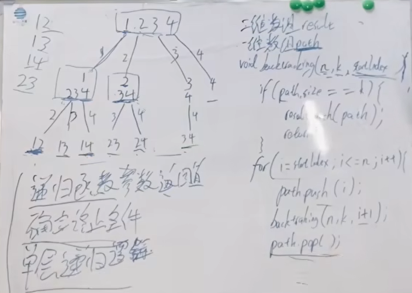

# 1 回溯理论
## 1.1 回溯解决什么问题？
回溯和递归相辅相成，递归函数就是回溯逻辑。

回溯是纯暴力搜索，针对有些使用循环解决不了的问题。例如：组合、字符串切割、子集、排列、棋盘（n皇后、解数独）。\
回溯的本质是对多层循环嵌套的模拟。相对于多层循环嵌套，回溯不需要提前设定嵌套层数。\
例：从集合$[1,2,3,4,....,100]$中找出50个元素的组合。
```python
def find(nums, amount):
    for i in range(len(nums)):
        for j in range(i, len(nums)):
            for k in range(j, len(nums)):
                ... # 50个元素的组合需要50次循环嵌套，100个元素的组合需要100次循环嵌套。
                # 回溯其实就是对多次循环嵌套的模拟
```

## 1.2 回溯三部曲
0 确定树形结构（自己总结后加的）  
1 确定递归函数参数及返回值\
2 确定递归终止条件\
3 确定单层搜索逻辑

如何理解回溯法？- 所有回溯法都可以抽象为树形结构。每个节点的宽度是被处理集合的大小。树的深度是递归的深度。\


## 1.3 回溯模板
```text
// 回溯一般没有返回值
void backtracking(参数列表): // 参数一般事先难确定，需要什么添加什么。
    if(终止条件):{
        收集结果到结果集 // 子集问题在每个节点收集结果，其他问题在叶子节点收集结果。
        return
    }
    // 单层搜索逻辑
    for (选择：本层集合中元素（树中节点孩子的数量就是集合的大小）) {
        处理节点;
        backtracking(路径，选择列表); // 递归
        回溯，撤销处理结果
    }
    return    
```

技巧1：数值变量的回溯可以写在调用backtracking的参数列表中，以省略回溯操作。
```shell
sum+=i # 更新
backtracking(i+1)
sum-=i # 回溯

# 可以简写为
backtracking(i+1,sum+i) # 这意味着当前函数中的sum值没有改变，省略了更新和回溯的操作
```

技巧2：使用used数组标记已经访问过的节点。详见：[回溯-去重](#15-回溯-去重)

技巧3：搜索整个树形结构返回值用void（收集所有可能结果），搜索单个树枝返回值用bool（只要收集到一个结果就返回）

### 1.3.2 组合
1 求组合，单层搜索逻辑中遍历从startIndex到n-1
2 如果有重复元素，需要排序，然后树层去重  
```python
def permute(nums: list[int]) -> list[list[int]]:
    n = len(nums)
    path, ans = [], []
    used = [0] * n

    def backtracking():
        if len(path) == n:
            ans.append(path.copy())
            return

        for i in range(0, n):  # 注意这里是从0到n-1
            if used[i] == 1: continue
            path.append(nums[i])
            used[i] = 1
            backtracking()
            used[i] = 0
            path.pop()
    backtracking()
    return ans
```
```python
def subsets2_3(nums: list[int]) -> list[list[int]]:
    """ 
        子集2
    """
    path, ans = [], []
    n = len(nums)
    def backtraking(cur):
        ans.append(path.copy())
        if cur>=n: return # 可以省略，因为单层逻辑最大为len(nums)
        used = set()
        for i in range(cur, n):
            if nums[i] in used:
                continue
            used.add(nums[i])
            path.append(nums[i])
            backtraking(i + 1)
            path.pop()
    nums.sort()
    backtraking(0)
    return ans
```

### 1.3.1 全排列
1 求排列，单层搜索逻辑中遍历从0到n-1  
2 需要used数组标记deep方向已经访问过的元素索引，类似树枝去重，去的是已访问过的元素  
3 如果有重复元素，需要树层去重  
```python
def permute(nums: list[int]) -> list[list[int]]:
    """ 
        全排列
        无重复数字数组 全排列 
        树枝去重
    """
    path, ans = [], []
    used = [0] * len(nums)

    def backtrack():
        if len(path) == len(nums):
            tmp = path.copy()
            ans.append(tmp)
            return
        for i in range(len(nums)): # 求排列，遍历从0到n-1
            if used[i]: continue
            path.append(nums[i])
            used[i] = 1
            backtrack()
            used[i] = 0
            path.pop()

    backtrack()
    return ans
```
```python
def permuteUnique(nums: list[int]) -> list[list[int]]:
    """
        全排列2
        原集合有重复元素
        树枝去重+树层去重
        需对原集合元素排序
    """
    n = len(nums)
    path, ans = [], []
    used_deep = [0] * n

    def backtracking():
        if len(path) == n:
            ans.append(path.copy())
            return
        used_level = set()
        for i in range(n):
            if used_deep[i] == 1: continue
            if nums[i] in used_level: continue
            path.append(nums[i])
            used_level.add(nums[i])
            used_deep[i] = 1
            backtracking()
            used_deep[i] = 0
            path.pop()

    nums.sort()
    backtracking()
    return ans
```
```python
""" 全排列 2 """
def permuteUnique2(nums: list[int]) -> list[list[int]]:
    n = len(nums)
    path, ans = [], []
    used = [0] * n

    def backtracking():
        if len(path) == n:
            ans.append(path.copy())
            return
        for i in range(n):
            # 树层去重，used[i]==0或者1都可以
            if i>0 and nums[i-1]==nums[i] and used[i-1]==0: continue # 树层上去重，更高效
            # if i>0 and nums[i-1]==nums[i] and used[i-1]==1: continue # 实际是树枝去重，较低效
            if used[i] == 1: continue
            path.append(nums[i])
            used[i] = 1
            backtracking()
            used[i] = 0
            path.pop()

    nums.sort()
    backtracking()
    return ans
```

## 1.4 回溯-剪枝

剪枝剪的是子节点，所以一定发生在单层搜索逻辑中，一般都是修改循环的退出条件，将`nums.size`修改为`n-(k-path.size)+1`。

为什么是`n-(k-path.size)+1`? - 例如：$4-(3-0)+1$，总共4个元素，找出3个元素的组合个数，现在已经添加了0个元素，则单层搜索最大子节点是$2$，
即$3$子树($[3,4]$)，和$4$子树($[4]$)一定不满足3个元素这个条件。
如果不加$1$，单层搜索最大子节点是$1$，那么$[2,3,4]$这个满足条件的答案将被剪枝。\
注：如果回溯初始从$1$开始，可访问上界为`n-(k-path.size)+1`；如果回溯初始从$0$开始，可访问上界为`n-(k-path.size)`


```python
def solve(k: int, n: int) -> list[list[int]]:
    """
        题目：组合总和3,
        回溯 剪枝
    """
    path, ans = [], []

    def backtracking(cur, sum):
        if len(path) == k or sum > n:  # 元素个数够了就退出，剪枝1：sum>n退出
            if sum == n:
                tmp = path.copy()
                ans.append(tmp)
            return
        # 因为回溯初始从1开始，可访问上界必须是n-(k-len(path))+1
        # 如果回溯初始从0开始，可访问上界必须是n-(k-len(path))
        for i in range(cur, 9 - (k - len(path)) + 1 + 1): # 剪枝2：单层搜索剪枝
            path.append(i)
            sum += i
            backtracking(i + 1, sum)
            sum -= i
            path.pop()
        return

    backtracking(1, 0)
    return ans
```

```python
def solve(k: int, n: int) -> list[list[int]]:
    """
        题目：组合总和3,
        回溯 剪枝 
        ***sum回溯写法优化***
    """
    path, ans = [], []

    def backtracking(cur, sum):
        if len(path) == k or sum > n:  # 元素个数够了就退出，剪枝1：sum>n退出
            if sum == n:
                tmp = path.copy()
                ans.append(tmp)
            return
        # 因为回溯初始从1开始，可访问上界必须是n-(k-len(path))+1
        # 如果回溯初始从0开始，可访问上界必须是n-(k-len(path))
        for i in range(cur, 9 - (k - len(path)) + 1 + 1): # 剪枝2：单层搜索剪枝
            path.append(i)
            backtracking(i + 1, sum+i) # 注意：这里将sum的回溯整合到函数参数中
            path.pop()
        return

    backtracking(1, 0)
    return ans
```

## 1.5 回溯-去重

树层去重：方法一：used数组去重； 方法二：startIndex去重\
树枝去重：方法：used数组去重。
结果去重

### 1.5.1 树层去重
在允许对原始集合排序的题目中树层去重：  
1 排序   
2 树层去重（used数组或者startIndex）  
> 子集2，组合总和2

在不允许对原始集合排序的题目中中树层去重：  
1 树层去重（used数组去重，因为没有对原始数集排序，所以每个单层逻辑都要重置used数组）  
> 非递减子序列  
> 注：该树层去重方法也能用于子集2和组合总和2，但必须对原始集合排序排序。  
> 如果用该树层去重方法解决子集2，并且不对原始集合排序，错误测试样例如下：  
> 测试样例：[4,4,4,1,4]  
> 1）如果不进行非递减操作：  
> 输出：[[],[4],[4,4],[4,4,4],[4,4,4,1],[4,4,4,1,4],[4,4,4,4],[4,4,1],[4,4,1,4],[4,1],[4,1,4],[1],[1,4]]  
> 预期：[[],[1],[1,4],[1,4,4],[1,4,4,4],[1,4,4,4,4],[4],[4,4],[4,4,4],[4,4,4,4]]  
> 注意输出中：[4,4,4,1] 和 [4,4,1,4] 属于重复子集  
> 2）如果进行非递减操作：  
> 输出：[[],[4],[4,4],[4,4,4],[4,4,4,4],[1],[1,4]]  
> 预期：[[],[1],[1,4],[1,4,4],[1,4,4,4],[1,4,4,4,4],[4],[4,4],[4,4,4],[4,4,4,4]]  
> 注意输出中：没有[1,4,4,4]，因为[4,4,4,1]被非递减操作过滤了

```python
def combinationSum2(candidates: list[int], target: int) -> list[list[int]]:
    """
        组合总和2
        回溯 - 树层去重 - used数组去重
    :param candidates:
    :param target:
    :return:
    """
    path, ans = [], []
    used = [False] * len(candidates)

    def backtrack(cur, sum):
        if sum > target: return
        if sum == target:
            tmp = path.copy()
            ans.append(tmp)
            return
        i = cur
        while i < len(candidates) and sum + candidates[i] <= target:
            # andidates[i]==candidates[i - 1] 和 not used[i-1] 共同保证了多个相同值元素中，第一个一定会被访问，其余都不会被访问。
            if i > 0 and candidates[i] == candidates[i - 1] and (not used[i - 1]): # 关键
                i += 1
                continue
            path.append(candidates[i])
            sum += candidates[i]
            used[i] = True
            backtrack(i + 1, sum)  # 这里是从i+1开始，用过的不能再用
            used[i] = False
            sum -= candidates[i]
            path.pop()
            i += 1


    candidates.sort()  # 该题目必须排序，因为有重复数字
    backtrack(0, 0)
    return ans
```

```python
def combinationSum2_2(candidates: list[int], target: int) -> list[list[int]]:
    """
        组合总和2
        回溯 - 树层去重 - startindex去重 该代码中cur即是startindex 
    """
    path, ans = [], []

    def backtrack(cur, sum):
        if sum > target: return
        if sum == target:
            tmp = path.copy()
            ans.append(tmp)
            return
        i = cur
        while i < len(candidates) and sum + candidates[i] <= target:
            # candidates[i]==candidates[i - 1] 和 i>cur 共同保证了多个相同值元素中，第一个一定会被访问，其余都不会被访问。
            if i > cur and candidates[i] == candidates[i - 1]: # 关键 注意：这里是i>cur与使用used数组树形去重中的i>0不同
                i += 1
                continue
            path.append(candidates[i])
            sum += candidates[i]
            backtrack(i + 1, sum)  # 这里是从i+1开始，用过的不能再用
            sum -= candidates[i]
            path.pop()
            i += 1

    candidates.sort()  # 该题目必须排序，因为有重复数字
    backtrack(0, 0)
    return ans

```

```python

def combinationSum2_4(candidates: list[int], target: int) -> list[list[int]]:
    """
        组合总和2
        回溯
        使用 used set 树层去重
    """
    n = len(candidates)
    path, ans = [], []

    def backtracking(cur, sum):
        if sum > target: return
        if sum == target:
            ans.append(path.copy())
            return
        used = set() # 也可以用字典hash
        for i in range(cur, n):
            val = candidates[i]
            if sum + val > target: continue
            if val in used: continue # 树层去重
            used.add(val) # 标记本层已访问过val
            path.append(val)
            backtracking(i + 1, sum + val)
            path.pop()
    candidates.sort()
    backtracking(0, 0)
    return ans
```


```python
def findSubsequences(nums: list[int]) -> list[list[int]]:
    """ 
        非递减子序列
        回溯 树层去重 
    """
    n = len(nums)
    path, ans = [], []

    def backtracking(startIndex):
        if len(path) >= 2:
            ans.append(path.copy())
        # if startIndex>=n: # 可省略，因为下面的循环最大为n-1，如果startIndex为n，不会再进入循环
        #     return
        used = {} # 也可以用set
        for i in range(startIndex, n): # 求组合时，从startIndex到n-1
            if nums[i] in used and used[nums[i]]==1: continue # 树层去重
            used[nums[i]] = 1
            if path and path[-1] > nums[i]: continue # 非递减过滤
            path.append(nums[i])
            backtracking(i + 1)
            path.pop()
    backtracking(0)
    return ans
```
### 1.5.2 树枝去重
used 数组标记已经访问过的节点  
```python
def permute(nums: list[int]) -> list[list[int]]:
    n = len(nums)
    path, ans = [], []
    used = [0] * n # 树枝去重

    def backtracking():
        if len(path) == n:
            ans.append(path.copy())
            return

        for i in range(0, n):  # 求排列时，注意这里是从0到n-1
            if used[i] == 1: continue
            path.append(nums[i])
            used[i] = 1 # 标记深度搜索方向当前索引位置的元素已被访问
            backtracking()
            used[i] = 0 # 回溯
            path.pop()
    backtracking()
    return ans
```

### 1.5.3 树层去重+树枝去重
1 排序（为了树层去重）
2 树层去重（used数组，或者 startIndex）  
3 树枝去重（used数组）  
```python
def permuteUnique(nums: list[int]) -> list[list[int]]:
    n = len(nums)
    path, ans = [], []
    used_deep = [0] * n # 树枝去重

    def backtracking():
        if len(path) == n:
            ans.append(path.copy())
            return
        used_level = set() # 树层去重
        for i in range(n): # 求排列时，遍历0~n-1
            if used_deep[i] == 1: continue # 树枝去重
            if nums[i] in used_level: continue # 树层去重
            path.append(nums[i])
            used_level.add(nums[i]) # 树层去重标记，无需排序
            used_deep[i] = 1 # 树枝去重标记，需要回溯
            backtracking()
            used_deep[i] = 0 # 回溯
            path.pop()

    nums.sort() # 排序，为了树层去重
    backtracking()
    return ans
```

## 2 相关题目
### 2.1 一维数组
### 2.1.1 组合问题
0077 组合 - 1 回溯； <font color='red'>2 非递归字典序法</font>\




0216 组合总和3 - 1回溯 \
注：该题中有两处剪枝操作。剪枝1：元素和大于目标值。剪枝2：单层搜索元素个数剪枝。\


0017 电话号码的字母组合 - 1 回溯\

LCR 0082 组合总和2 - 1 回溯\
注：树层去重。方法一：used数组；方法二：startIndex


### 2.1.2 排列问题
0046 全排列\
注：树枝去重。方法：used数组  


0022 括号生成 - <font color='red'>1 暴力法</font> 2 回溯法 <font color='red'>3 按括号序列的长度递归</font> \
注：回溯与传统回溯写法不同。字符串结果去重。

### 2.1.3 字符串切割
#### 2.1.3.1 理论
单层搜索逻辑中确定切割区间$[cur, i+1]$。


#### 2.1.3.2 相关题目
LCR 0086 分割回文子串\
注：可以使用动态规划预处理回文子串判断逻辑，`dp[i][j]=(dp[i+1][j-1] and s[i]==s[j])`。
注：如果切割子串不满足条件，continue。例如：a|ab|a，因为ab不是回文子串，所以跳过继续执行后面的逻辑，再切割a|aba|，符合要求。\

LCR 0087 复原IP地址\
注：如果切割子串不满足条件，直接return。例如：0|1111|11，因为1111不符合要求，则后面没必要切割了，再切割是0|11111|1，一定不符合要求

### 2.1.4 子集
#### 2.1.4.1 理论
与字符串切割相同
#### 2.4.2 相关题目
LCR 0079 子集 - 1 回溯

0090 子集2 - 1 回溯 \
注：有重复元素，树层去重：使用used数组，或者startIndex树层去重。

0491 非递减子序列  


## 2.2 二维数组
原始数组为二维矩阵  
场景1 递归行，单层搜索逻辑中处理一行中的所有列。（N皇后）  
场景2 递归格子，单层搜索逻辑中处理格子中所有可能值。（解数独）  
### 2.2.1 N皇后
原始数组为二维矩阵，递归依次处理每一行，单层搜索逻辑中处理一行中的所有列。
### 2.2.2 解数独
原始数组为二维矩阵，递归依次处理每个格子（矩阵中每个位置），单层搜索逻辑中处理每个格子所有可能值。  

