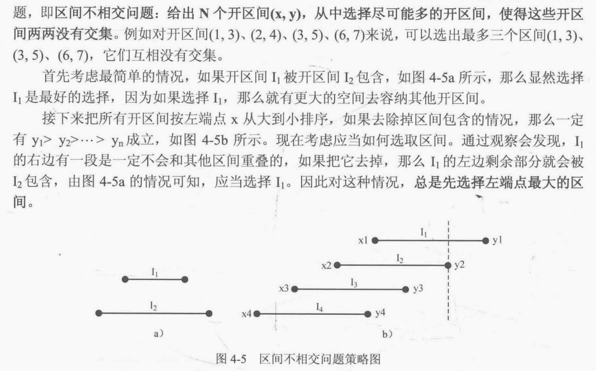
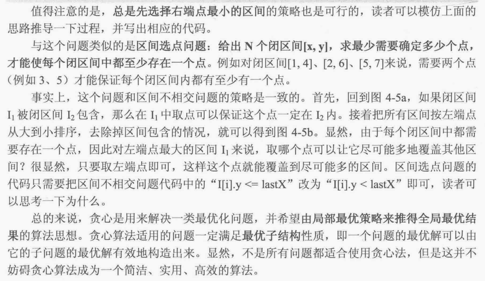

# 贪心理论

取每个阶段的局部最优解

注：因为每一阶段只做局部最优选择，所以一般复杂度低。  
注：不一定能得到全局最优解，只有在问题具有贪心选择性质时才有效。  
注：贪心算法没有模板和套路，没有规律。

## 贪心思路（不实用）

1 想清楚每个阶段的局部最优解  
2 寻找反例证明根据局部最优解无法推出全局最优解（因为没有办法可以验证局部最优解是否能推出全局最优解）  
3 如果找不出反例，可以尝试使用贪心算法求解

## 贪心四部曲（实用）

1 将问题分解为若干子问题
2 找出适合的贪心策略
3 求解每个子问题的最优解
4 将局部最优解堆叠成全局最优解

# 贪心适用题目

## 摆动序列

leetcode 0376 摆动序列 - 1 贪心；2 动态规划；\
求局部峰值/谷底

## 最大子序和

leetcode 0053 最大子数组和（最大子序和）\
局部最优的情况下，并记录最大的“连续和”，可以推出全局最优。\

## 买卖股票的最佳时机2

leetcode 0122 买卖股票的最佳时机2  
只要利润大于0，就累加。

## 最小生成树

## 两个维度贪心

先考虑一个维度，再考虑另一个维度

### 题目

leetcode 0135 分发糖果  

leetcode 0406 根据身高重建队列

## 区间贪心

### 区间贪心-理论

区间不相交问题：给出N个开区间$(x,y)$，从中选择尽可能多的开区间，使得这些开区间两两没有交集



区间选点问题：给出N个闭区间$[x,y]$，求最少需要确定多少个点，才能使每个闭区间中都至少存在一个点



#### 区间贪心-三部曲

【推荐】**贪心思路**:

1 左端点从小到大排序，或者右端点从小到大  
2 遍历取出符合条件的区间，区间不相交问题中`cur_left>=pre_right`，区间选点问题中`cur_left>pre_right`   
3 分两种情况处理：  
Case 1: 当前区间与上一个区间没有重叠区；  
Case 2: 当前区间与上一个区间有重叠区`cur_left<pre_right` - 需要更新当前区间的右端点为pre_right；

```python
def findMinArrowShots3(points: list[list[int]]) -> int:
    """ 卡尔版 """
    points.sort(key=lambda x: (x[1]))
    print(points)
    ans = 1
    for i in range(1, len(points)):
        if points[i][0] > points[i - 1][1]:  # 当前区间左端点大于上一个区间右端点
            ans += 1
        else:  # 当前区间左端点小于等于上一个区间右端点
            # 重复区间取右端点较小
            # 例：[1,3] [2,4] [3,5]
            points[i][1] = min(points[i][1], points[i - 1][1])  # 更新当前区间端点为与上个区间右端点相比的较大值
    return ans
```

<span style="color: red">
注：测试中发现，下面的方法与上面的方法相比，  <br>
在有些题目中好用（例如区间选点问题-箭引爆气球中无需处理重叠情况，遇到重叠区间直接跳过，
因为事先不但按照左端点排序，而且还按照右端点进行了排序，已经优先选了右端点较小者）<br>  
有些题目中不好用（例如区间合并问题-左端点从大到小排序，测试样例`[[2,3],[4,5],[6,7],[8,9],[1,10]]`，
先放了很多区间，最后一个区间包含了前面所有区间，处理的时候需要迭代处理有重叠区间，直到已经添加到结果集中的区间没有重叠为止，
该情况下，使用卡尔的办法更好---左端点从小到大，不排序右端点，但在逻辑中需要处理有重叠区间的情况）。</span>

详请请见：[leetcode-0435-合并区间](../01-intervals/2-leetcode-0435-non-overlapping-intervals.py)

【不推荐】贪心思路1：优先取左端点较大的区间  
1 左端点从大到小排序，如果左端点相同，按照右端点从小到大排序（重复区间取右端点较小者）  
2 遍历取出符合条件的区间，区间不相交问题中`cur_right<=pre_left`，区间选点问题中`cur_right<pre_left`
3 分两种情况处理：当前区间与上一个区间有重叠区；当前区间与上一个区间没有重叠区

> 为什么重复区间取右端点较小者？  
> 例如：[1,3], [2,5], [4,6]，如果重复区间取右端点较大者。  
> (1) 计数器初始化为1，上个区间初始化为[1,3]  
> (2) 2<3，判断当前区间与上个区间有重复，计数器不计数，更新右端点较大者，右端点为5  
> (3) 4<5，判断当前区间与上个区间有重复，计数器不计数，更新右端点较大者，右端点为6  
> 发现：计数结果为1，三个区间都被判断为重复区间。这不合理，因为如果选点为3，只能命中前两个区间，如果选点为4，只能命中后两个区间，
> 找不到一个点，可以同时命中三个区间。

【不推荐】贪心思路2：优先取右端点较小的区间  
1 右端点从小到大排序，如果右端点相同，按照左端点从大到小排序（重复区间取左端点较大者）  
2 遍历取出符合条件的区间，区间不相交问题中`cur_right<=pre_left`，区间选点问题中`cur_right<pre_left`  
3 分两种情况处理：当前区间与上一个区间有重叠区；当前区间与上一个区间没有重叠区

```python
def findMinArrowShots(points: list[list[int]]) -> int:
    """ 贪心思路1 优先取左端点较大的区间 """
    points.sort(key=lambda x: (-x[0], x[1]))
    print(points)
    pre_left = points[0][1] + 1  # 上一个区间的左端点，初始值赋值为左端点最大的区间的右端点+1
    ans = 0
    for point in points:
        cur_right = point[1]
        if cur_right < pre_left:  # 这里必须是小于，不能是小于等于，例[2,3] [1,2]，只选择[2,3]即可选中2，没有必要再选择2也在的区间[1,2]
            ans += 1
            pre_left = point[0]  # pre_left=cur_left
    return ans
```

```python
def findMinArrowShots2(points: list[list[int]]) -> int:
    """ 贪心思路2：优先取右端点最小 """
    points.sort(key=lambda x: (x[1], -x[0]))
    print(points)
    ans = 0
    pre_right = points[0][0] - 1  # 上一个区间的右端点，初始化为第一个区间的左端点-1
    for point in points:
        cur_left = point[0]  #
        if cur_left > pre_right:  # 当前左端点大于上一个区间的右端点
            ans += 1
            pre_right = point[1]  # 更新 pre_right
    return ans
```

### 相关题目

leetcode 0452 用最少数量的箭引爆气球

leetcode 0435 无重叠区间  

leetcode 0056 合并区间  

leetcode 0763 划分字母区间  
注：此题与跳远游戏相似  


## 其他

leetcode 0860 柠檬水找零  
贪心局部最优：每次找零都尽量用较大的面额找零  
