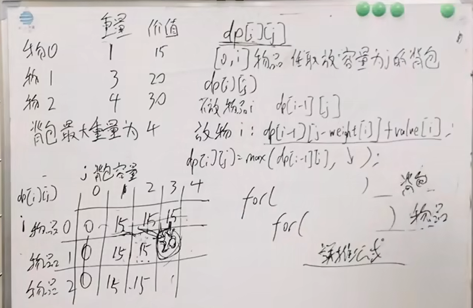
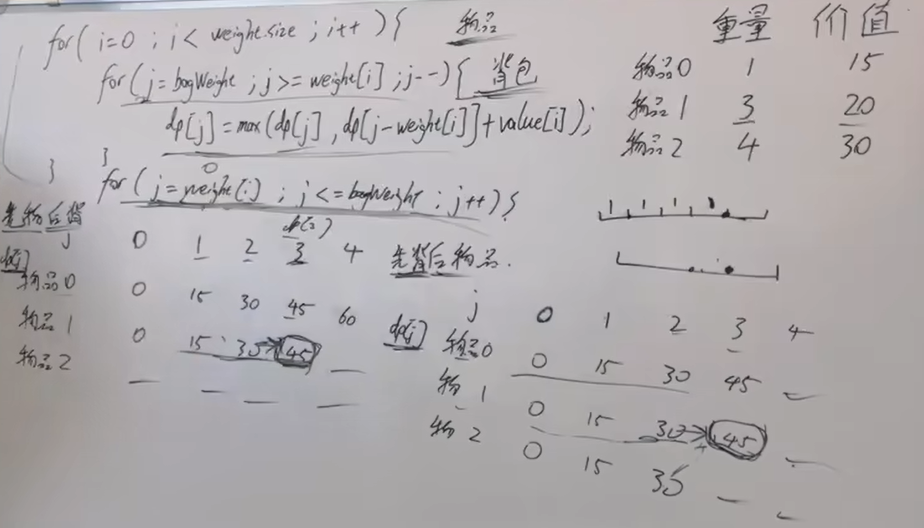

# 9.9 动态规划

**五个步骤：** 1 DP数组的含义；2 递推公式；3 DP数组的初始化；4 DP数组遍历顺序；5 打印DP数组

## 基础题目

斐波那契数列\
爬楼梯\
不同路径\
不同路径2\
整数拆分\
不同二叉搜索树\

## 背包问题

### 01背包
#### 理论
定义：n种物品，每种物品只能使用一次。
遍历：二维数组实现的01背包，先遍历背包或者先遍历物品都可以。（因为递推公式由左上方和正上方推出）\




```python
""" 二维dp数组 """
def beibao01()->int:
    wupin, bagweight = [int(x) for x in input().split()]
    weight = [int(x) for x in input().split()]
    value = [int(x) for x in input().split()]
    dp = [[0]*(bagweight+1) for _ in range(wupin)]
    # dp矩阵，第一行，只有物品0，所以容量大于物品0的背包容量初始化为物品0的价值
    for i in range(weight[0], bagweight+1): # 第一行初始化
        dp[0][i] = value[0]
    # 二维dp数组的01背包写法：先遍历物品再遍历背包，或者，先遍历背包再遍历物品，都可以。
    for i in range(1, wupin): # 物品从1开始（dp矩阵第二行），因为物品0已经初始化（dp矩阵第一行）。
        for j in range(1, bagweight+1): # 背包容量从1开始（dp矩阵第二列），因为背包容量为0已经初始化为0，没有价值（dp矩阵第一列）
            if j>=weight[i]:
                dp[i][j]=max(dp[i-1][j], dp[i-1][j-weight[i]]+value[i])
            else:
                dp[i][j]=dp[i-1][j]
    return dp[wupin-1][bagweight]
    
ans = beibao01()
print(ans)
```

```python
""" 一维dp数值  滚动数组 """
def beibao01()->int:
    wupin, bagweight = [int(x) for x in input().split()]
    weight = [int(x) for x in input().split()]
    value = [int(x) for x in input().split()]
    dp = [0]*(bagweight+1)
    # 一维dp数组的01背包写法：先遍历物品，再遍历背包，顺序不能颠倒
    for i in range(wupin): # 从0开始，因为dp没有初始化
        for j in range(bagweight,weight[i]-1,-1): # 01背包一维dp数组写法：背包遍历必须倒序，防止同一物品被使用多次
            dp[j]=max(dp[j], dp[j-weight[i]]+value[i]) #
 
    return dp[bagweight]
     
ans = beibao01()
print(ans)
```

#### 题目

<u>纯01背包</u> \
注：背包容量固定，求装满容器的最大价值。

<u>LeetCode LCR101 分割等和子集 (416 partition equal subset sum) - 1 动态规划 O(nxtarget) O(target)</u> \
注：背包容量固定，求容器是否能被装满。


<u>LeetCode 1049 最后一块石头的重量 II (1049 last stone weight II) - 1 动态规划 O(nxtarget) O(target)</u> \
注：背包容量固定，求容器最多能装多少容量。

<u>LeetCode LCR 0102 目标和 (494 target sum) - 1 动态规划 O(nxtarget) O(target)</u> \
注：背包容量固定，求容器装满有多少种方法。

<u>LeetCode 0474 一和零 (0474 ones and zeros) - 1 动态规划</u> \
注：背包容量固定，求容器装满最多能装多少个物品。\
注：背包容量是两个维度，0的个数和1的个数。对比传统01背包问题中背包容量只有一个维度。对比完全背包问题中背包容量只有一个维度，物品数量不一样。\
注：背包使用二维数组表示，但不是传统01背包中的二维dp数组，写法仍然按照传统01背包中的滚动数组的写法：先正序遍历物品再倒序遍历背包（遍历背包是两层循环）


### 完全背包

#### 理论
n种物品，每种物品可以使用多次

<font color="red"> 纯完全01背包问题：遍历顺序先物品后背包，或者，先背包后物品，都可以。</font><br>
因为纯完全背包求得装满背包的最大价值是多少，和凑成总和的元素<u>是否有顺序没关系</u>，即：有顺序也行，没有顺序也行！<br><br>




先遍历物品后遍历背包：组合（没有顺序，结果中只有1,2，不可能有2,1，因为外层循环物品从0到n依次遍历）

```python
def change(target: int, items: list[int]) -> int:
    """
        完全背包 动态规划 先遍历物品后遍历背包
    """
    n = len(items)
    dp = [0] * (target + 1)
    dp[0] = 1
    # 在每一轮物品 i 的遍历中，更新所有可能的背包容量 j，确保每个物品可以被多次选择。
    for i in range(n):  # 先遍历物品
        for j in range(items[i], target + 1):  # 后遍历背包
            dp[j] = dp[j] + dp[j - items[i]]
        print(i, dp)
    return dp[-1]
```

先遍历背包后遍历物品：排列（有顺序，结果中既有1,2也有2,1，因为每轮迭代都会遍历所有物品，物品是内层循环）

在先遍历背包后遍历物品的代码中，由于每次对容量 j 都尝试所有物品，因此会统计所有可能的排列。
在代码中，$dp[j] = max(dp[j], dp[j - weights[i]] + values[i])$ 会多次更新 $dp[j]$，
每次更新都基于不同的物品选择顺序。 这种更新方式会导致 $dp[j]$ 的值受到物品选择顺序的影响，从而得到排列数。

例如：
对于容量 j = 3 \
尝试放入物品 A：$dp[3] = max(dp[3], dp[2] + 1) = 3$ \
尝试放入物品 B：$dp[3] = max(dp[3], dp[1] + 2) = 3$ \
结果：$dp[3] = 3$ \
在这个过程中，$dp[3]$ 的值是通过多次尝试不同的物品选择顺序得到的，因此最终结果是排列数。 \

```python
def change2(amount: int, items: list[int]) -> int:
    """
        完全背包 动态规划 先遍历背包后遍历物品
    """
    n = len(items)
    dp = [0] * (amount + 1)
    dp[0] = 1
    # 在每一轮背包容量 j 的遍历中，尝试放入每一个物品 i，更新 dp[j]
    for j in range(amount + 1):  # 先遍历背包
        for i in range(n):  # 后遍历物品
            if j >= items[i]:
                
                dp[j] = dp[j] + dp[j - items[i]]
            # print(' ', i, dp)
        print(j, dp)
    return dp[-1]
```

#### 题目
0518 零钱兑换2 - 1 动态规划（完全背包）\
题目：已知coins(不同面额，每种硬币无限多)，总金额amount，求凑成总金额的硬币组合数。\
注：该题求组合数（不能重复），遍历顺序不能修改，必须先遍历背包后遍历物品。

0377 组合总和4 - 1 动态规划（完全背包）\

0322 零钱兑换 - 1 动态规划（完全背包）\
题目：已知coins(不同面额，每种硬币无限多)，总金额amount，求凑成总金额所需的最少的硬币个数。\
注：硬币个数与是否有顺序无关，可以先遍历物品后遍历背包，也可以先遍历背包后遍历物品。

0279 完全平方数 - 1 动态规划\
题目：整数 n ，返回 和为n 的完全平方数的最少数量。\
注：最少数量与是否有顺序无关，可以先遍历物品后遍历背包，也可以先遍历背包后遍历物品。\
注：本题完全平方数判断技巧：在dp更新时，判断`i*i<=j`。

<font color='red'>0139 单词拆分 - 1 动态规划（完全背包） 2 回溯 </font>\
注：两种方法都还没完全理解。


### 多重背包

n种物品，每种物品个数不同

## 打家劫舍
### 理论
### 相关题目
0198 打家劫舍 - 1 动态规划-滚动数组\
题目：相邻房间不能偷，求最大金额。\
注：dp数组初始化，`dp[0]=nums[0], dp[1]=max(nums[0],nums[1])`

LCR 0090 打家劫舍2 - 1 动态规划-滚动数组\
题目：环形数组，相邻房间不能偷，求最大金额。\
注：环形数组的处理办法 `max(nums[1:],nums[:-1])`


## 树形dp
### 理论
滚动数组：处理完当前层节点后处理下一层节点时更新。相当于每层都有一个数组记录当前层状态。\
遍历顺序：最终结果保存在root节点，所以需要后序遍历。

打家劫舍3


## 股票问题
### 理论
### 相关题目
#### leetcode 0121 买卖股票的最佳时机 - 1 动态规划；2 贪心；3 暴力搜索找最优区间（超时）；4 双指针\
注：保持持有股票状态`dp[i][1]=max(dp[i-1][1], 0-prices[i])`，题目要求只能买卖一次，所以首次买入股票时手头金额一定是初始值0，没有递推关系。\
注：如果该题定义三个状态，则保持持有股票状态`dp[i][1]=max(dp[i-1][1], 0-prices[i])`可以写为`dp[i][1]=max(dp[i-1][1], dp[i][0]-prices[i])`。
前者只是将状态1省略了。
> 状态0：未进行过任何操作；\
> 状态1：保持持有（包含买入和已买入后保持）；\
> 状态2：保持不持有（包含卖出和已卖出保持）；\

#### leetcode 0122 买卖股票的最佳时机2 - 1 动态规划；2 贪心；\
注：持有股票状态`dp[i][1]=max(dp[i-1][1], dp[i-1][0]-prices[i])`，题目要求可以买卖多次，所以买入股票时手头金额不一定是初始值0，有递推关系。

#### leetcode 0123 买卖股票的最佳时机3 - 1 动态规划；\
注：本题dp数组，包含五个状态（其中`状态1：未进行过任何操作`状态可以省略）\
> 状态0：未进行过任何操作；\
> 状态1：保持第一次持有（包含第一次买入和已第一次买入后保持）；\
> 状态2：保持第一次不持有（包含第一次卖出和已第一次卖出后保持）；\
> 状态3：保持第二次持有（包含第二次买入和已第二次买入后保持）；\
> 状态4：保持第二次不持有（包含第二次卖出和已第二次卖出后保持）。

#### leetcode 0188 买卖股票的最佳时机4 \
注：本题dp数组，包含2k+1个状态（其中`状态1：未进行过任何操作`状态可以省略）
> 状态0：未进行过任何操作；\
> 状态i+1：保持第i次持有（包含第i次买入和已第i次买入后保持）；\
> 状态i+2：保持第i次不持有（包含第i次卖出和已第i次卖出后保持）；

#### leetcode 0309 买卖归家的最佳时机含冷冻期\
注：本题dp数组，包含4个状态（其中`状态1：未进行过任何操作`状态可以省略）\
注：`leetcode 0122 买卖股票的最佳时机2`中`保持不持有状态`在该题中需要拆分为`已卖出后保持不持有`与`卖出`两个状态，以处理`冷冻期`状态。`冷冻期`状态依赖于前一天`卖出`状态
> 状态0：未进行过任何操作；\
> 状态1：保持持有（包含买入和已买入后保持）；\
> 状态2：已卖出后保持不持有；\
> 状态3：卖出；\
> 状态4：冷冻期。


## 子序列问题
### 理论
### 相关题目
leetcode 0300 最长递增子序列\
注：最终结果需要求dp数组最大值

leetcode 0674 最长连续递增序列\
注：最终结果需要求dp数组最大值

leetcode 0718 最长重复子数组\
注：两个数组求最常重复子数组，二维dp数组。\
注：使用`i-1,j-1`以简化初始化方法。
注：最终结果需要求dp数组最大值

leetcode 1143 最长公共子序列\
注：最终结果`dp[-1][-1]`

leetcode 1035 不相交的线\
注：最终结果`dp[-1][-1]`

leetcode 0053 最大子数组和\
注：最终结果`dp[-1][-1]`

