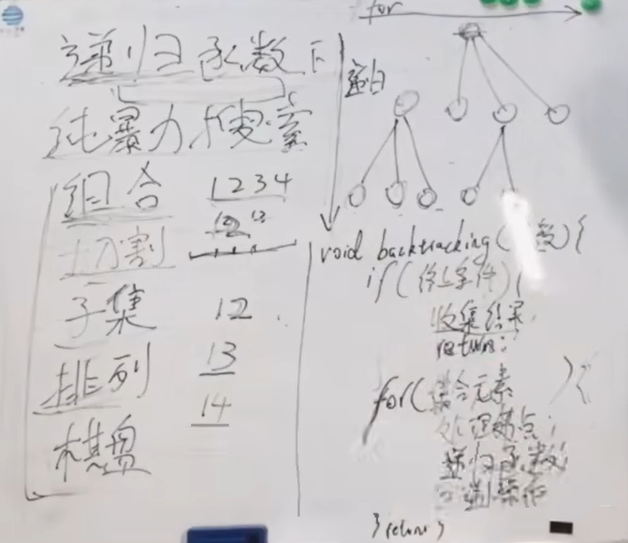
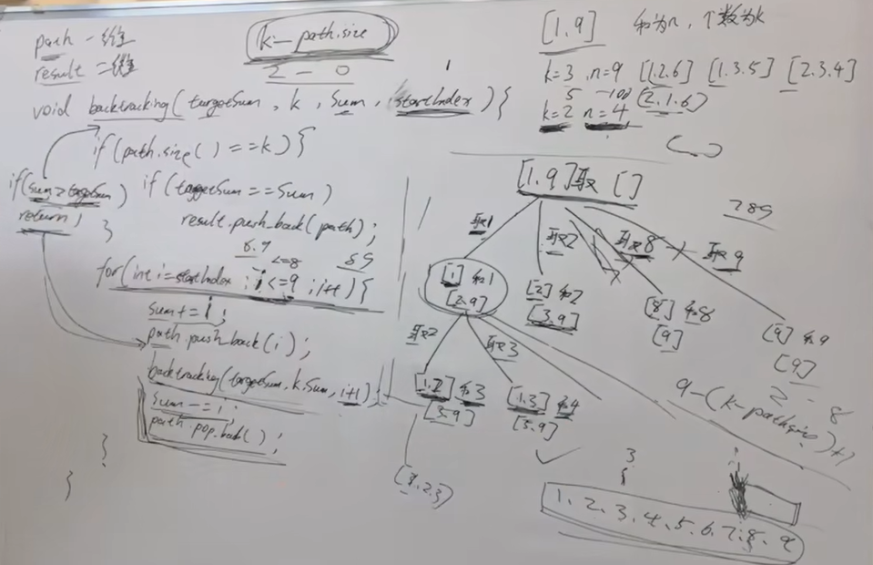
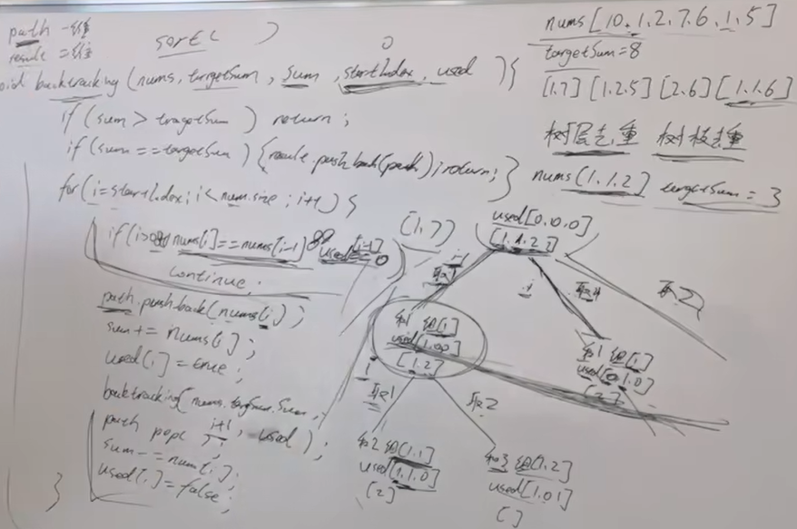
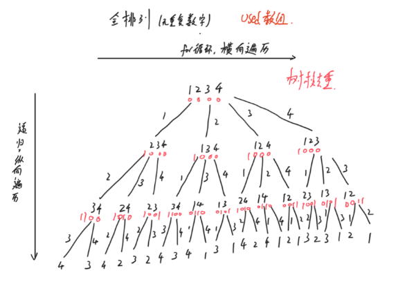
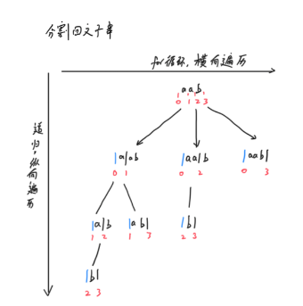

# 1 回溯理论
## 1.1 回溯解决什么问题？
回溯和递归相辅相成，递归函数就是回溯逻辑。

回溯是纯暴力搜索，针对有些使用循环解决不了的问题。例如：组合、字符串切割、子集、排列、棋盘（n皇后、解数独）。\
回溯的本质是对多层循环嵌套的模拟。相对于多层循环嵌套，回溯不需要提前设定嵌套层数。\
例：从集合$[1,2,3,4,....,100]$中找出50个元素的组合。
```python
def find(nums, amount):
    for i in range(len(nums)):
        for j in range(i, len(nums)):
            for k in range(j, len(nums)):
                ... # 50个元素的组合需要50次循环嵌套，100个元素的组合需要100次循环嵌套。
                # 回溯其实就是对多次循环嵌套的模拟
```

## 1.2 回溯三部曲
1 确定递归函数参数及返回值\
2 确定递归终止条件\
3 确定单层搜索逻辑

如何理解回溯法？- 所有回溯法都可以抽象为树形结构。每个节点的宽度是被处理集合的大小。树的深度是递归的深度。\




## 1.3 回溯模板
```text
// 回溯一般没有返回值
void backtracking(参数列表): // 参数一般事先难确定，需要什么添加什么。
    if(终止条件):{
        收集结果到结果集 // 子集问题在每个节点收集结果，其他问题在叶子节点收集结果。
        return
    }
    // 单层搜索逻辑
    for (选择：本层集合中元素（树中节点孩子的数量就是集合的大小）) {
        处理节点;
        backtracking(路径，选择列表); // 递归
        回溯，撤销处理结果
    }
    return    
```

### 1.3.1 全排列
```python
""" 无重复数字数组 全排列 """
def permute(nums: list[int]) -> list[list[int]]:
    path, ans = [], []
    used = [0] * len(nums)

    def backtrack():
        if len(path) == len(nums):
            tmp = path.copy()
            ans.append(tmp)
            return
        for i in range(len(nums)):
            if used[i]: continue
            path.append(nums[i])
            used[i] = 1
            backtrack()
            used[i] = 0
            path.pop()

    backtrack()
    return ans
```


## 1.4 回溯-剪枝

剪枝剪的是子节点，所以一定发生在单层搜索逻辑中，一般都是修改循环的退出条件，将`nums.size`修改为`n-(k-path.size)+1`。

为什么是`n-(k-path.size)+1`? - 例如：$4-(3-0)+1$，总共4个元素，找出3个元素的组合个数，现在已经添加了0个元素，则单层搜索最大子节点是$2$，
即$3$子树($[3,4]$)，和$4$子树($[4]$)一定不满足3个元素这个条件。
如果不加$1$，单层搜索最大子节点是$1$，那么$[2,3,4]$这个满足条件的答案将被剪枝。\
注：如果回溯初始从$1$开始，可访问上界为`n-(k-path.size)+1`；如果回溯初始从$0$开始，可访问上界为`n-(k-path.size)`


```python
def solve(k: int, n: int) -> list[list[int]]:
    """
        题目：组合总和3,
        回溯 剪枝
    """
    path, ans = [], []

    def backtracking(cur, sum):
        if len(path) == k or sum > n:  # 元素个数够了就退出，剪枝1：sum>n退出
            if sum == n:
                tmp = path.copy()
                ans.append(tmp)
            return
        # 因为回溯初始从1开始，可访问上界必须是n-(k-len(path))+1
        # 如果回溯初始从0开始，可访问上界必须是n-(k-len(path))
        for i in range(cur, 9 - (k - len(path)) + 1 + 1): # 剪枝2：单层搜索剪枝
            path.append(i)
            sum += i
            backtracking(i + 1, sum)
            path.pop()
            sum -= i
        return

    backtracking(1, 0)
    return ans
```

## 1.5 回溯-去重

树层去重：方法一：used数组去重； 方法二：startIndex去重\
树枝去重：方法：used数组去重。
结果去重


```python
def combinationSum2(candidates: list[int], target: int) -> list[list[int]]:
    """
        回溯 - 树层去重 - used数组去重
    :param candidates:
    :param target:
    :return:
    """
    path, ans = [], []
    used = [False] * len(candidates)

    def backtrack(cur, sum):
        if sum > target: return
        if sum == target:
            tmp = path.copy()
            ans.append(tmp)
            return
        i = cur
        while i < len(candidates) and sum + candidates[i] <= target:
            if i > 0 and candidates[i] == candidates[i - 1] and (not used[i - 1]): # 关键
                i += 1
                continue
            path.append(candidates[i])
            sum += candidates[i]
            used[i] = True
            backtrack(i + 1, sum)  # 这里是从i+1开始，用过的不能再用
            used[i] = False
            sum -= candidates[i]
            path.pop()
            i += 1


    candidates.sort()  # 该题目必须排序，因为有重复数字
    backtrack(0, 0)
    return ans
```

```python
def combinationSum2_2(candidates: list[int], target: int) -> list[list[int]]:
    """
        回溯 - 树层去重 - startindex去重
    """
    path, ans = [], []

    def backtrack(cur, sum):
        if sum > target: return
        if sum == target:
            tmp = path.copy()
            ans.append(tmp)
            return
        i = cur
        while i < len(candidates) and sum + candidates[i] <= target:
            if i > cur and candidates[i] == candidates[i - 1]: # 关键
                i += 1
                continue
            path.append(candidates[i])
            sum += candidates[i]
            backtrack(i + 1, sum)  # 这里是从i+1开始，用过的不能再用
            sum -= candidates[i]
            path.pop()
            i += 1

    candidates.sort()  # 该题目必须排序，因为有重复数字
    backtrack(0, 0)
    return ans

```

## 2 相关题目
### 2.1 组合问题
0077 组合 - 1 回溯； <font color='red'>2 非递归字典序法</font>\


0216 组合总和3 - 1回溯 \
注：该题中有两处剪枝操作。剪枝1：元素和大于目标值。剪枝2：单层搜索元素个数剪枝。\



0017 电话号码的字母组合 - 1 回溯\

LCR 0082 组合总和2 - 1 回溯\
注：树层去重。方法一：used数组；方法二：startIndex




0046 全排列\
注：树枝去重。方法：used数组



0022 括号生成 - <font color='red'>1 暴力法</font> 2 回溯法 <font color='red'>3 按括号序列的长度递归</font> \
注：回溯与传统回溯写法不同。字符串结果去重。

### 2.2 字符串切割
#### 2.1 理论
单层搜索逻辑中确定切割区间$[cur, i+1]$。



#### 2.2 相关题目
LCR 0086 分割回文子串\
注：可以使用动态规划预处理回文子串判断逻辑，`dp[i][j]=(dp[i+1][j-1] and s[i]==s[j])`。
注：如果切割子串不满足条件，continue。例如：a|ab|a，因为ab不是回文子串，所以跳过继续执行后面的逻辑，再切割a|aba|，符合要求。\

LCR 0087 复原IP地址\
注：如果切割子串不满足条件，直接return。例如：0|1111|11，因为1111不符合要求，则后面没必要切割了，再切割是0|11111|1，一定不符合要求

### 2.3 子集
#### 2.3.1 理论
与字符串切割相同
#### 2.3.2 相关题目
LCR 0079 子集 - 1 回溯

0090 子集2 - 1 回溯 \
注：有重复元素，树层去重：使用used数组，或者startIndex树层去重。