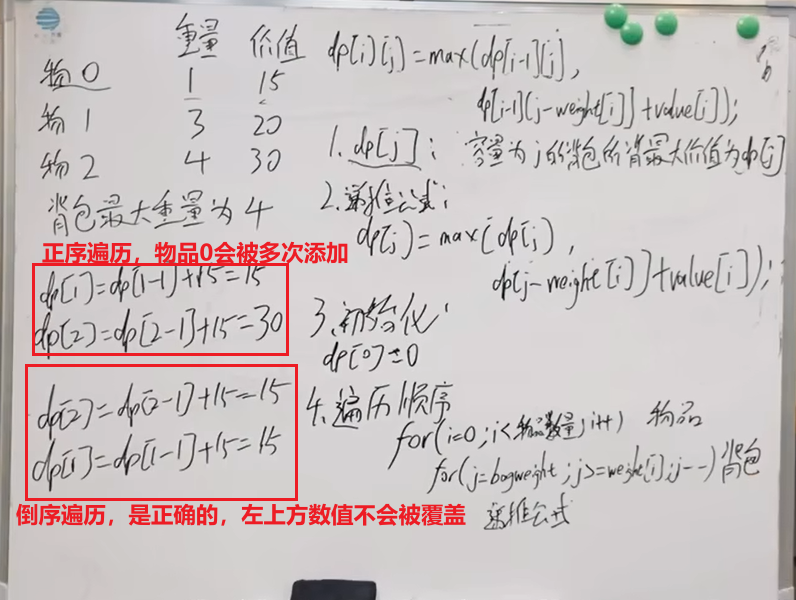

# 1 面试经典150题

## 1.1 数组_字符串

跳跃游戏

# 9 题目分类

# 9.1 二分查找

## 基础理论
**适用题目：有序序列中是否存在满足某条件的元素**

易错点1：`while(lef<right)` 还是 `while(lef<=right)`?\
易错点2：`if(arr\[mid]>target)` 是 `right = mid` 还是 `right = mid-1`?\
易错点3：`right` 初始化 是 `right=len(arr)` 还是  `right=len(arr)-1`?

确定区间类型（是左闭右开还是左闭右闭）？ - 确定区间类型才能确定三个易错点的内容，确定区间类型后，整个算法编写过程都要遵循这个区间类型\

```python
def search(nums: list[int], target: int) -> int:
    """
        左闭右闭
    """
    left, right = 0, len(nums) - 1  # 右闭，所以right=len(arr)-1
    while left <= right:  # 右闭，所以right必须能访问到
        mid = left + (right - left) // 2
        if nums[mid] == target:
            return mid
        elif nums[mid] < target:
            left = mid + 1
        else:
            right = mid - 1  # 右闭，因为已经判断mid>target，所以右边界不能是mid，必须是mid-1
    return -1
```

```python
def search(nums: list[int], target: int) -> int:
    """
        左闭右开
    """
    left, right = 0, len(nums)  # 右开，所以定义为len(nums)，下一轮右开区间一定不包含mid
    while left < right:  # 右开，所以right不能被访问到
        mid = left + (right - left) // 2
        if nums[mid] == target:
            return mid
        elif nums[mid] < target:
            left = mid + 1
        else:
            right = mid  # 右开，并且已经判断了nums[mid]>target，所以下一轮右开区间一定不包含mid
    return -1
```

特殊情况1：lower_bound，求序列中第一个大于等于x的元素的位置（寻找有序序列第一个满足“值大于等于x”的元素的位置）

```python
def lowerbound(nums: list[int], target: int) -> int:
    left, right = 0, len(nums)  # 左闭右开，有可能最后一个元素都小于target，所以最后一个元素必须能访问到。
    while left < right:
        mid = left + (right - left) // 2
        # 注意这里没有 nums[mid] == target，整个算法需要[left,right]夹住答案
        if nums[mid] >= target:  # 注意这一步，必须有等号
            right = mid
        else:
            left = mid + 1
    return left # 如果数组中所有元素都小于target，最后left=right=n
```

特殊情况2：upper_bound，求序列中第一个大于x的元素的位置（寻找有序序列第一个满足“值大于x”的元素的位置）

```python
def upperbound(nums: list[int], target: int) -> int:
    left, right = 0, len(nums)  # 左闭右开，有可能最后一个元素都小于target，所以最后一个元素必须能访问到。
    while left < right:
        mid = left + (right - left) // 2
        # 注意这里没有 nums[mid] == target，整个算法需要[left,right]夹住答案
        if nums[mid] > target:  # 注意这一步，没有等号
            right = mid
        else:
            left = mid + 1
    return left # 如果数组中所有元素都小于target，最后left=right=n
```

特殊情况3：寻找有序序列第一个满足“条件!=C”的元素的位置。\
使用上面的满足“条件==C”的方法求解index后，再减一。

特殊情况4：递减序列。\
使用上面的方法，将`nums[mid]>x`修改为`nums[mid]<x`

## 题目

0274 H 指数\
0035 搜索插入位置\
0074 搜索二维矩阵
0162 寻找峰值\
0033 搜索旋转排序数组\


# 9.9 动态规划

**五个步骤：** 1 DP数组的含义；2 递推公式；3 DP数组的初始化；4 DP数组遍历顺序；5 打印DP数组

## 基础题目

斐波那契数列\
爬楼梯\
不同路径\
不同路径2\
整数拆分\
不同二叉搜索树\

## 背包问题

### 01背包

定义：n种物品，每种物品只有一个。
遍历：二维数组实现的01背包，先遍历背包或者先遍历物品都可以。（因为递推公式由左上方和正上方推出）\




### 完全背包

n种物品，每种物品有无限个

### 多重背包

n种物品，每种物品个数不同

## 打家劫舍

## 股票问题

## 子序列问题