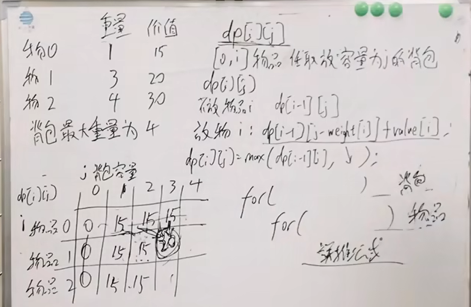

# 动态规划
**五个步骤：** 1 DP数组的含义；2 递推公式；3 DP数组的初始化；4 DP数组遍历顺序；5 打印DP数组
## 基础题目
斐波那契数列\
爬楼梯\
不同路径\
不同路径2\
整数拆分\
不同二叉搜索树\
## 背包问题
### 01背包
定义：n种物品，每种物品只有一个。
遍历：二维数组实现的01背包，先遍历背包或者先遍历物品都可以。（因为递推公式由左上方和正上方推出）\

### 完全背包
n种物品，每种物品有无限个

### 多重背包
n种物品，每种物品个数不同

## 打家劫舍
## 股票问题
## 子序列问题