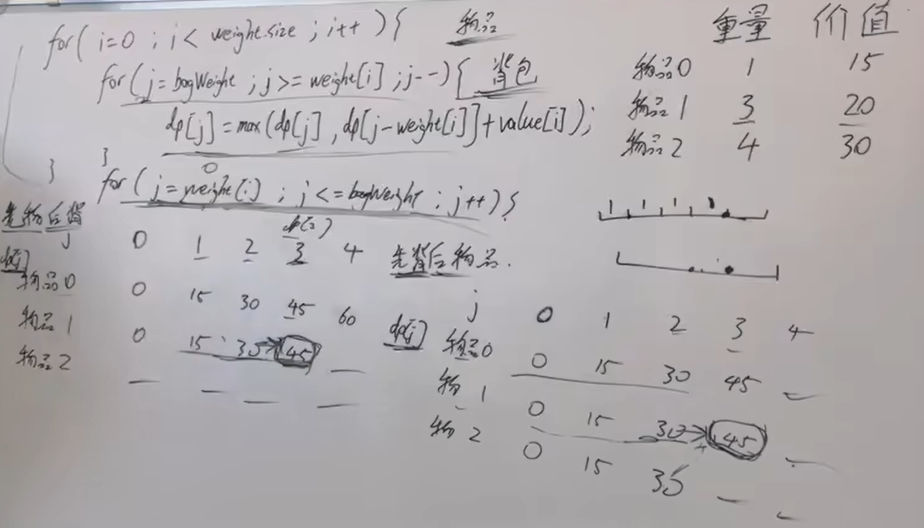

# 目录
- [1 面试经典150题](#1 面试经典150题)
# 1 面试经典150题

## 1.1 数组_字符串
0088 合并两个有序数组 - 1 合并后排序O((m+n)log(m+n)) O(log(m+n))快排空间复杂度； 2 双指针 O(m+n) O(m+n)；3 逆向双指针 O(m+n) O(1)

移除元素 - 1 双指针 O(n) O(1)；2 双指针优化 O(n) O(1) 

删除有序数组中的重复项 - 

删除有序数组中的重复项2 -

多数元素 - 

轮转数组 - 

买卖股票的最佳时机 - 

买卖股票的最佳时机2 - 

跳跃游戏 - 

跳跃游戏2 - 

H指数 - 


## 1.2 双指针
0125 验证回文串 - 1 反转对比；2 双指针；

0392 判断子序列 - 1 双指针； <font color='red'>2 动态规划；</font>
## 1.3 滑动窗口

## 1.4 矩阵

## 1.5 哈希表

## 1.6 区间

## 1.7 栈
0071 简化路径 - 1 栈 O(n) O(1)


## 1.8 链表

## 1.9 二叉树

## 1.10 二叉树层次遍历

## 1.11 二叉搜索树

## 1.12 图

## 1.13 图的广度优先搜索

## 1.14 字典树

## 1.15 回溯

## 1.16 分治

## 1.17 kandane算法

## 1.18 二分查找
0035 搜索插入位置 - 1 二分查找 O(logn) O(1)

0074 搜索二维矩阵 - 1 行、列-两次二分查找 O(logn+logm)=O(lognm) O(1)；2 索引映射-一次二分查找O(logmn) O(1)

0162 寻找峰值 - 1 寻找最大值 O(n) O(1)；2 迭代爬坡 O(n) O(1)；3 二分查找 O(logn) O(1) 

<u>0033 搜索旋转排序数组 - 1 二分查找 O(logn) O(1) </u>

0034 在排序数组中查找元素的第一个和最后一个位置 - 1 二分查找 O(logn) O(1) lowerbound and upperbound


## 1.19 堆

## 1.20 位运算

## 1.21 数学

## 1.22 一维动态规划
爬楼梯 - 1 动态规划


## 1.23 多维动态规划

# 9 题目分类

# 9.1 二分查找

## 基础理论
**适用题目：有序序列中是否存在满足某条件的元素**

易错点1：`while(lef<right)` 还是 `while(lef<=right)`?\
易错点2：`if(arr\[mid]>target)` 是 `right = mid` 还是 `right = mid-1`?\
易错点3：`right` 初始化 是 `right=len(arr)` 还是  `right=len(arr)-1`?

确定区间类型（是左闭右开还是左闭右闭）？ - 确定区间类型才能确定三个易错点的内容，确定区间类型后，整个算法编写过程都要遵循这个区间类型\

```python
def search(nums: list[int], target: int) -> int:
    """
        左闭右闭
    """
    left, right = 0, len(nums) - 1  # 右闭，所以right=len(arr)-1
    while left <= right:  # 右闭，所以right必须能访问到
        mid = left + (right - left) // 2
        if nums[mid] == target:
            return mid
        elif nums[mid] < target:
            left = mid + 1
        else:
            right = mid - 1  # 右闭，因为已经判断mid>target，所以右边界不能是mid，必须是mid-1
    return -1
```

```python
def search(nums: list[int], target: int) -> int:
    """
        左闭右开
    """
    left, right = 0, len(nums)  # 右开，所以定义为len(nums)，下一轮右开区间一定不包含mid
    while left < right:  # 右开，所以right不能被访问到
        mid = left + (right - left) // 2
        if nums[mid] == target:
            return mid
        elif nums[mid] < target:
            left = mid + 1
        else:
            right = mid  # 右开，并且已经判断了nums[mid]>target，所以下一轮右开区间一定不包含mid
    return -1
```

特殊情况1：lower_bound，求序列中第一个大于等于x的元素的位置（寻找有序序列第一个满足“值大于等于x”的元素的位置）

```python
def lowerbound(nums: list[int], target: int) -> int:
    left, right = 0, len(nums)  # 左闭右开，有可能最后一个元素都小于target，所以最后一个元素必须能访问到。
    while left < right:
        mid = left + (right - left) // 2
        # 注意这里没有 nums[mid] == target，整个算法需要[left,right]夹住答案
        if nums[mid] >= target:  # 注意这一步，必须有等号
            right = mid
        else:
            left = mid + 1
    return left # 如果数组中所有元素都小于target，最后left=right=n
```

特殊情况2：upper_bound，求序列中第一个大于x的元素的位置（寻找有序序列第一个满足“值大于x”的元素的位置）

```python
def upperbound(nums: list[int], target: int) -> int:
    left, right = 0, len(nums)  # 左闭右开，有可能最后一个元素都小于target，所以最后一个元素必须能访问到。
    while left < right:
        mid = left + (right - left) // 2
        # 注意这里没有 nums[mid] == target，整个算法需要[left,right]夹住答案
        if nums[mid] > target:  # 注意这一步，没有等号
            right = mid
        else:
            left = mid + 1
    return left # 如果数组中所有元素都小于target，最后left=right=n
```

特殊情况3：寻找有序序列第一个满足“条件!=C”的元素的位置。\
使用上面的满足“条件==C”的方法求解index后，再减一。

特殊情况4：递减序列。\
使用上面的方法，将`nums[mid]>x`修改为`nums[mid]<x`

## 题目

0274 H 指数
0035 搜索插入位置\
0074 搜索二维矩阵
0162 寻找峰值\
0033 搜索旋转排序数组\
0034 在排序数组中查找元素的第一个和最后一个位置\

# 快速幂
## 理论
```python
def myPow(x: float, n: int) -> float:
        if x==0.0:return 0.0 # 处理底数为0的情况
        if n < 0: x, n = 1 / x, -n
        ret = 1
        while n:
            if n&1: ret = ret * x # 奇数处理 x^5=x(x^2)^2
            x = x * x # 偶数翻倍
            n = n>>1 # 除以2
        return ret
```
## 题目
0050 pow(x,n) - 1 快速幂


# 9.8 回溯
# 9.9 动态规划

**五个步骤：** 1 DP数组的含义；2 递推公式；3 DP数组的初始化；4 DP数组遍历顺序；5 打印DP数组

## 基础题目

斐波那契数列\
爬楼梯\
不同路径\
不同路径2\
整数拆分\
不同二叉搜索树\

## 背包问题

### 01背包[003-26-Remove-Duplicates-from-Sorted-Array.py](01-Top-Interview-150/01-array-string/003-26-Remove-Duplicates-from-Sorted-Array.py)
#### 理论
定义：n种物品，每种物品只能使用一次。
遍历：二维数组实现的01背包，先遍历背包或者先遍历物品都可以。（因为递推公式由左上方和正上方推出）\


```python
""" 二维dp数组 """
def beibao01()->int:
    wupin, bagweight = [int(x) for x in input().split()]
    weight = [int(x) for x in input().split()]
    value = [int(x) for x in input().split()]
    dp = [[0]*(bagweight+1) for _ in range(wupin)]
    # dp矩阵，第一行，只有物品0，所以容量大于物品0的背包容量初始化为物品0的价值
    for i in range(weight[0], bagweight+1): # 第一行初始化
        dp[0][i] = value[0]
    # 二维dp数组的01背包写法：先遍历物品再遍历背包，或者，先遍历背包再遍历物品，都可以。
    for i in range(1, wupin): # 物品从1开始（dp矩阵第二行），因为物品0已经初始化（dp矩阵第一行）。
        for j in range(1, bagweight+1): # 背包容量从1开始（dp矩阵第二列），因为背包容量为0已经初始化为0，没有价值（dp矩阵第一列）
            if j>=weight[i]:
                dp[i][j]=max(dp[i-1][j], dp[i-1][j-weight[i]]+value[i])
            else:
                dp[i][j]=dp[i-1][j]
    return dp[wupin-1][bagweight]
    
ans = beibao01()
print(ans)
```

```python
""" 一维dp数值  滚动数组 """
def beibao01()->int:
    wupin, bagweight = [int(x) for x in input().split()]
    weight = [int(x) for x in input().split()]
    value = [int(x) for x in input().split()]
    dp = [0]*(bagweight+1)
    # 一维dp数组的01背包写法：先遍历物品，再遍历背包，顺序不能颠倒
    for i in range(wupin): # 从0开始，因为dp没有初始化
        for j in range(bagweight,weight[i]-1,-1): # 01背包一维dp数组写法：背包遍历必须倒序，防止同一物品被使用多次
            dp[j]=max(dp[j], dp[j-weight[i]]+value[i]) #
 
    return dp[bagweight]
     
ans = beibao01()
print(ans)
```

#### 题目

<u>纯01背包</u> \
注：背包容量固定，求装满容器的最大价值。

<u>LeetCode LCR101 分割等和子集 (416 partition equal subset sum) - 1 动态规划 O(nxtarget) O(target)</u> \
注：背包容量固定，求容器是否能被装满。


<u>LeetCode 1049 最后一块石头的重量 II (1049 last stone weight II) - 1 动态规划 O(nxtarget) O(target)</u> \
注：背包容量固定，求容器最多能装多少容量。

<u>LeetCode LCR 0102 目标和 (494 target sum) - 1 动态规划 O(nxtarget) O(target)</u> \
注：背包容量固定，求容器装满有多少种方法。

<u>LeetCode 0474 一和零 (0474 ones and zeros) - 1 动态规划</u> \
注：背包容量固定，求容器装满最多能装多少个物品。\
注：背包容量是两个维度，0的个数和1的个数。对比传统01背包问题中背包容量只有一个维度。对比完全背包问题中背包容量只有一个维度，物品数量不一样。\
注：背包使用二维数组表示，但不是传统01背包中的二维dp数组，写法仍然按照传统01背包中的滚动数组的写法：先正序遍历物品再倒序遍历背包（遍历背包是两层循环）


### 完全背包

#### 理论
n种物品，每种物品可以使用多次



纯完全01背包问题：遍历顺序先物品后背包，或者，先背包后物品，都可以。


先遍历物品后遍历背包：组合（只有1,2，不可能有2,1，因为物品是从0到n依次遍历）

```python
def change(target: int, items: list[int]) -> int:
    """
        完全背包 动态规划 先遍历物品后遍历背包
    """
    n = len(items)
    dp = [0] * (target + 1)
    dp[0] = 1
    # 在每一轮物品 i 的遍历中，更新所有可能的背包容量 j，确保每个物品可以被多次选择。
    for i in range(n):  # 先遍历物品
        for j in range(items[i], target + 1):  # 后遍历背包
            dp[j] = dp[j] + dp[j - items[i]]
        print(i, dp)
    return dp[-1]
```

先遍历背包后遍历物品：排列（既有1,2也有2,1，因为每轮迭代都会遍历所有物品）

在先遍历背包后遍历物品的代码中，由于每次对容量 j 都尝试所有物品，因此会统计所有可能的排列。
在代码中，$dp[j] = max(dp[j], dp[j - weights[i]] + values[i])$ 会多次更新 $dp[j]$，
每次更新都基于不同的物品选择顺序。 这种更新方式会导致 $dp[j]$ 的值受到物品选择顺序的影响，从而得到排列数。

例如：
对于容量 j = 3 \
尝试放入物品 A：$dp[3] = max(dp[3], dp[2] + 1) = 3$ \
尝试放入物品 B：$dp[3] = max(dp[3], dp[1] + 2) = 3$ \
结果：$dp[3] = 3$ \
在这个过程中，$dp[3]$ 的值是通过多次尝试不同的物品选择顺序得到的，因此最终结果是排列数。 \

```python
def change2(amount: int, items: list[int]) -> int:
    """
        完全背包 动态规划 先遍历背包后遍历物品
    """
    n = len(items)
    dp = [0] * (amount + 1)
    dp[0] = 1
    # 在每一轮背包容量 j 的遍历中，尝试放入每一个物品 i，更新 dp[j]
    for j in range(amount + 1):  # 先遍历背包
        for i in range(n):  # 后遍历物品
            if j >= items[i]:
                
                dp[j] = dp[j] + dp[j - items[i]]
            # print(' ', i, dp)
        print(j, dp)
    return dp[-1]
```

#### 题目

0377 组合总和4 - 1 回溯


### 多重背包

n种物品，每种物品个数不同

## 打家劫舍

## 股票问题

## 子序列问题